## Indexing and Retrieval of 3D videos

### Using subvideos of 90 Frames with overlap of 30 frames in adjacent subvideos

1.
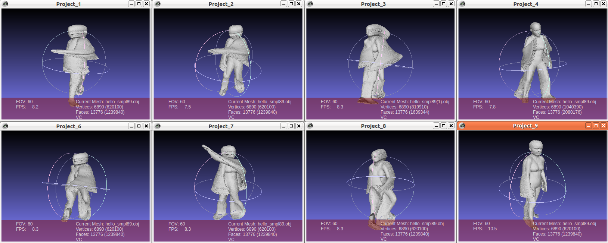
(first is the test sub video and rest are its nearest neighbours)
 
 
 

2.
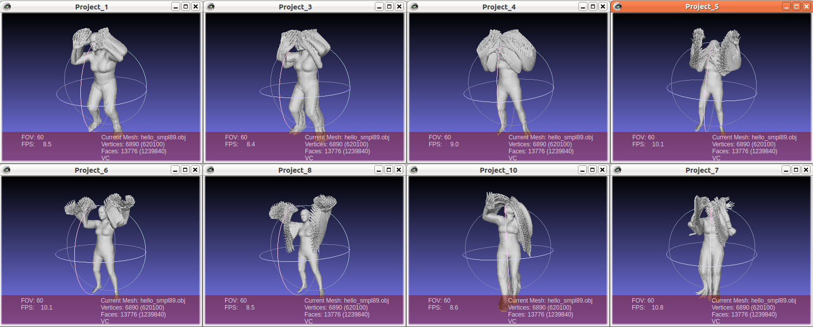
(first is the test sub video and rest are its nearest neighbours)
 
 
 

3.
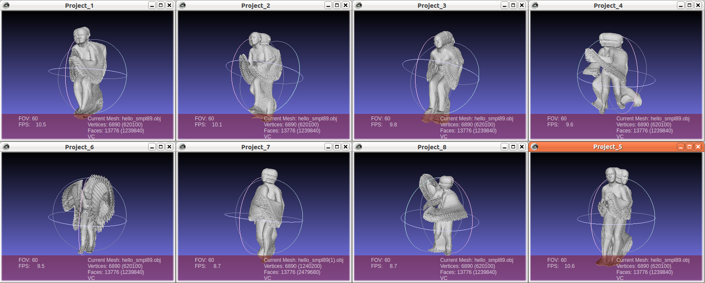
(first is the test sub video and rest are its nearest neighbours)
 
 
 
4.
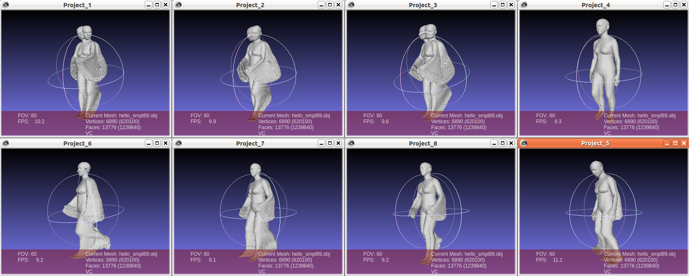
(first is the test sub video and rest are its nearest neighbours)

 
 
 

### Using optical flow subvideos of 90 Frames with overlap of 30 frames in adjacent subvideos

1.
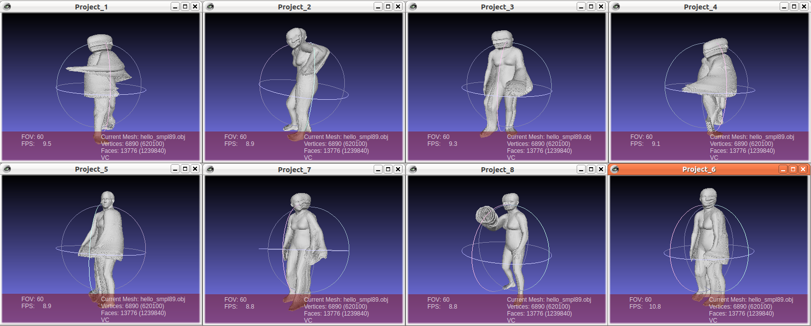
(first is the test sub video and rest are its nearest neighbours)
 
 
 

2.
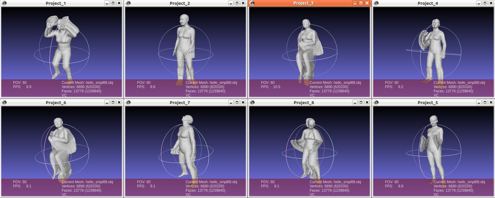
(first is the test sub video and rest are its nearest neighbours)
 
 
 

3.
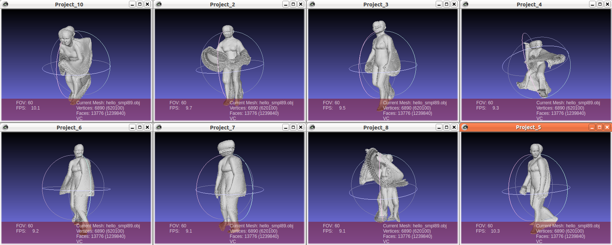
(first is the test sub video and rest are its nearest neighbours)
 
 
 
4.
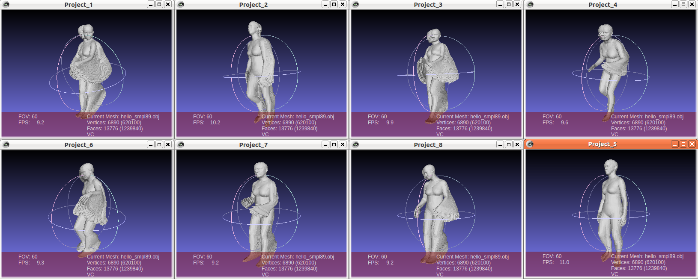
(first is the test sub video and rest are its nearest neighbours)

 
 
 

3-dimentional plot for tSNE features of output of all the test videos
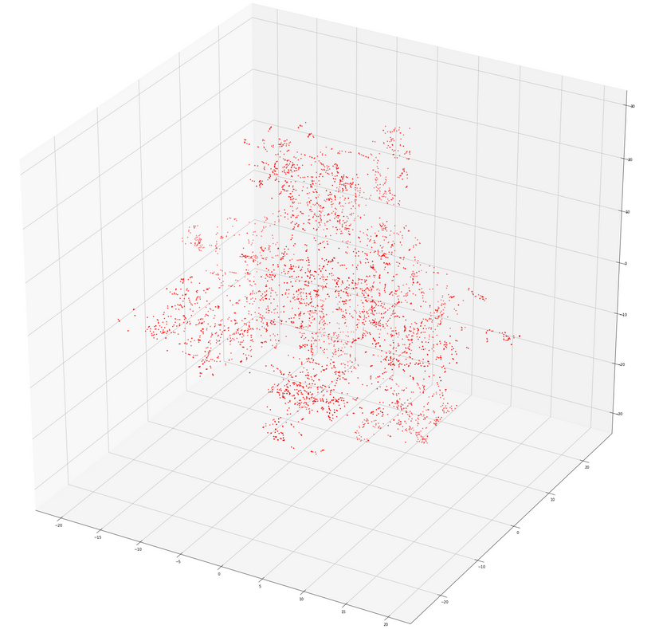
 
 
2-dimentional plot for tSNE features of output of all the test videos
 
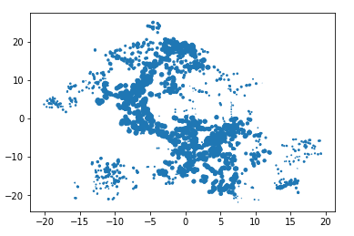
 
 

 
 

3-dimentional plot for tSNE features of output of optical flow of all the test videos
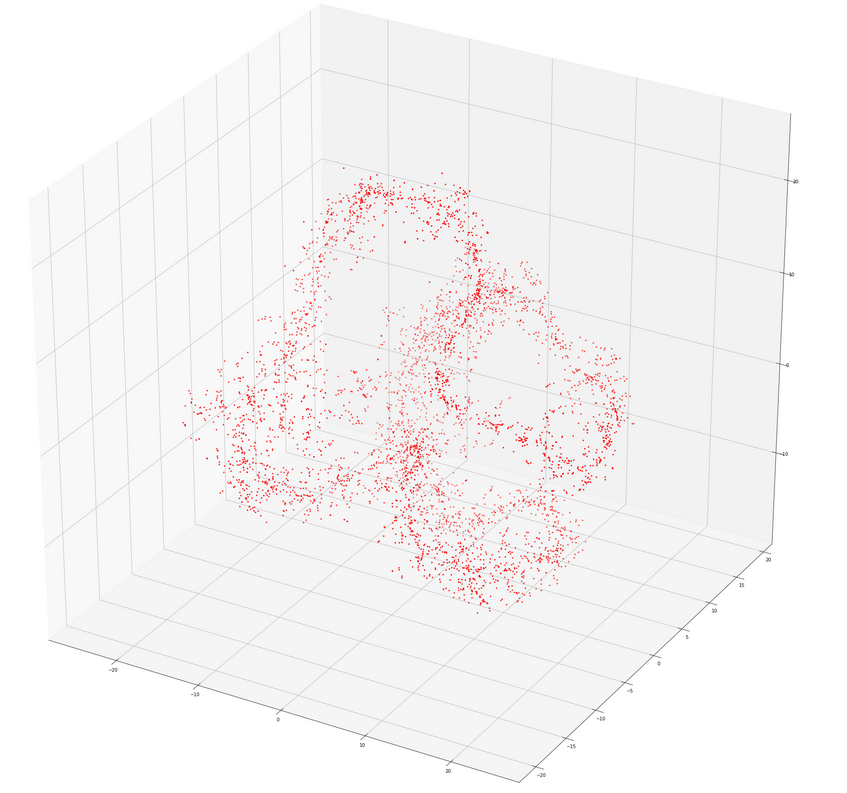
 
 
2-dimentional plot for tSNE features of output of optical flow of all the test videos
 
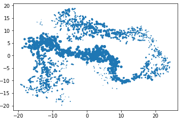
 
 
